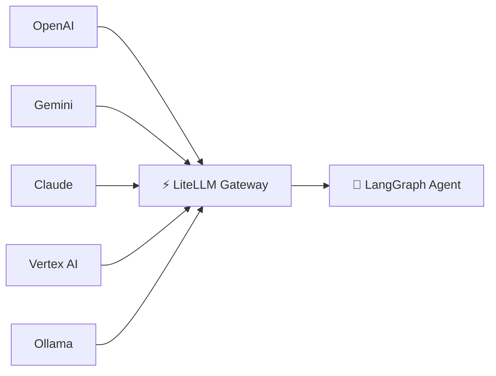
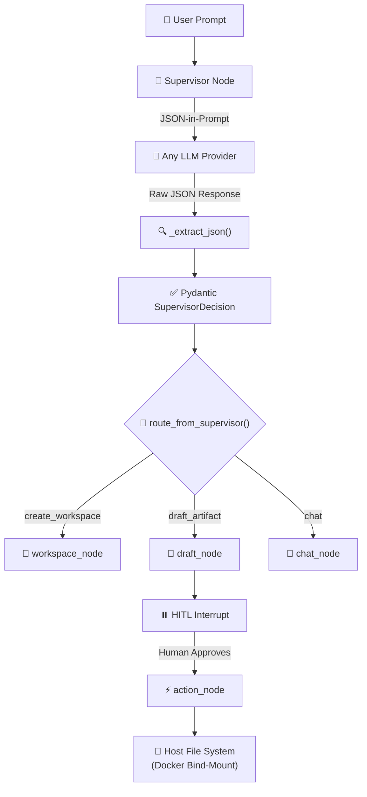

<div align="center">

# 🌌 SideloadOS

### The Universal AI Operating System

*A stateful, human-in-the-loop execution engine for declarative AI workflows.*

[](https://fastapi.tiangolo.com/)
[](https://nextjs.org/)
[](https://langchain-ai.github.io/langgraph/)
[](https://www.postgresql.org/)
[](https://www.docker.com/)
[](https://litellm.ai/)
[](https://redis.io/)
[](https://opensource.org/licenses/MIT)

---

**SideloadOS is the console. Blueprints are the cartridges.**

</div>

---

## 🔭 The Vision

Most AI tools are disposable. You type a prompt, get a response, and the context evaporates. **SideloadOS is the opposite.**

SideloadOS is a **stateful, human-in-the-loop (HITL) execution engine** designed to run **Sideload Blueprints** — declarative AI workflow definitions that describe *what* should happen, not *how*. Think of it like a gaming console:

- **SideloadOS** is the hardware — the operating system, the runtime, the memory, and the display.
- **Blueprints** are the cartridges — plug one in and the system executes a complex, multi-step AI workflow with full human oversight at every critical decision point.

The engine doesn't just run prompts. It **orchestrates agents**, **persists memory across reboots**, **pauses for human approval**, and **streams every step** to a rich IDE-like interface in real time.

---

## 🏗️ The Architecture — The 6 Pillars

### 🔌 Pillar 1: The Universal AI Gateway

> *Hot-swap any AI model with zero code changes.*

Powered by **[LiteLLM](https://litellm.ai/)**, SideloadOS provides a unified interface to every major AI provider. Switch between **OpenAI**, **Google Gemini**, **Anthropic Claude**, **Google Vertex AI**, or a local **Ollama** instance by changing a single dropdown — no code modifications, no redeployment, no vendor lock-in.



---

### 🧠 Pillar 2: Persistent Deep Memory

> *The AI's memory survives server reboots.*

Powered by **[LangGraph](https://langchain-ai.github.io/langgraph/)** with **PostgreSQL Checkpointers**, every conversation thread, agent state, and execution checkpoint is serialized to the database. Restart the server, redeploy the container — the agent picks up exactly where it left off with full conversational context intact.

---

### ⚡ Pillar 3: The God-Tier HITL Engine

> *The system physically pauses execution and waits for human approval.*

This is not a "confirm/cancel" dialog. When a LangGraph agent produces a draft artifact (code, document, plan), the engine:

1. **Pauses** the graph execution at an `interrupt()` checkpoint.
2. **Streams** the draft to a rich editor (Monaco for code, Tiptap for prose) in the Artifact Workbench.
3. **Waits** — the workflow is frozen in the database until the human acts.
4. **Resumes** via an isolated `BackgroundTask` when the user clicks **Approve & Execute**, carrying any human edits forward into the next graph step.

No polling. No timeouts. Full human agency over every AI decision.

---

### 🖥️ Pillar 4: The Antigravity GUI

> *A strict 100vh, non-scrolling, 3-pane IDE layout.*

The frontend is a **Next.js** application that mirrors the look and feel of a professional code editor:

| Pane | Role | Default Width |
|------|------|:---:|
| **Command Center** (Left) | Workspace & task tree navigation | 20% |
| **Action Stream** (Center) | Live execution cards, real-time SSE streaming, Omnibar | 80% |
| **Artifact Workbench** (Right) | Monaco/Tiptap editors with approval controls | 0% → 40% |

Communication is real-time via **WebSockets** (system events) and **Server-Sent Events** (agent execution streaming). The right pane is hidden by default and expands only when a `[Review Artifact]` card is clicked, resizing the layout to 20/40/40.

---

### 🧭 Pillar 5: The Master Router & Local File I/O

> *A universal JSON-in-prompt Supervisor that works with every LLM, and a Docker bind-mount that writes approved code to your hard drive.*

Standard LangChain tool-calling relies on each LLM provider supporting a specific function-calling API — which means different providers break in different ways. SideloadOS **bypasses this entirely** with a universal **JSON-in-prompt** pattern:

1. The **Supervisor Node** injects a Pydantic-defined JSON schema directly into the system prompt.
2. The LLM returns raw JSON (not a tool call), which is parsed by a robust `_extract_json()` helper that strips markdown fences and handles edge cases.
3. The parsed `SupervisorDecision` is validated by Pydantic and routed via `route_from_supervisor()` to the correct downstream node.

This works identically across OpenAI, Gemini, Claude, Vertex AI, and Ollama — **zero provider-specific code paths**.

When the human approves an artifact, the **Action Node** writes the file to the host filesystem via a Docker bind-mount (`./workspaces:/app/workspaces`), giving the AI physical access to your project directory.



---

### 🧬 Pillar 6: The Blueprint Matrix

> *The hardcoded graph topology has been destroyed. The OS compiles its brain from YAML at runtime.*

SideloadOS no longer has a hardcoded LangGraph. Instead, the engine reads **declarative Blueprint YAML files** from the `/app/blueprints/` directory and compiles them into live, executable state graphs at runtime.

**How it works:**

1. `blueprint_schema.py` defines a **Pydantic schema** (`BlueprintDef`) that validates the YAML structure — nodes, edges, conditional edges, entry points, and interrupt points.
2. `blueprint_parser.py` uses **`importlib`** to dynamically import Python handler functions from dotted paths (e.g., `engine.graph.supervisor_node`).
3. An **`@lru_cache(maxsize=128)`** ensures each handler is imported exactly once into memory — the YAML is read fresh, but the Python modules are blazingly fast.
4. The compiled `StateGraph` is returned ready for `.ainvoke()` or `.astream_events()`.

**Example Blueprint** (`blueprints/default.yaml`):

```yaml
name: "SideloadOS Core"
entry_point: "supervisor_node"

interrupt_before:
  - "action_node"

nodes:
  - name: "supervisor_node"
    handler: "engine.graph.supervisor_node"
  - name: "draft_node"
    handler: "engine.graph.draft_node"
  - name: "action_node"
    handler: "engine.graph.action_node"

edges:
  - source: "draft_node"
    target: "action_node"
  - source: "action_node"
    target: "__end__"

conditional_edges:
  - source: "supervisor_node"
    router: "engine.graph.route_from_supervisor"
    path_map:
      draft_artifact: "draft_node"
      chat: "chat_node"
```

Drop a new `.yaml` file into `blueprints/`, change one environment variable, and the OS **instantly learns an entirely new workflow** — no code changes, no server restarts. **SideloadOS is the console; Blueprints are the cartridges.**

---

## 🚀 Quick Start

### Prerequisites

- [Docker](https://docs.docker.com/get-docker/) & Docker Compose
- [Node.js](https://nodejs.org/) ≥ 18
- (Optional) [Google Cloud CLI](https://cloud.google.com/sdk/docs/install) — for Vertex AI models via ADC

### 1. Configure Environment

```bash
cp .env.example .env
# Edit .env and set your actual values:
#   POSTGRES_PASSWORD   — Database password
#   FERNET_KEY          — Encryption key for API key storage
#   SIDELOAD_BLUEPRINT  — Path to the active Blueprint YAML (default provided)
#   VERTEXAI_PROJECT    — (Optional) Your GCP project ID for Vertex AI
#   VERTEXAI_LOCATION   — (Optional) Must be "global" for preview models
```

> [!WARNING]
> **Mac/Linux Users:** The `docker-compose.yml` ADC volume mount uses the Windows-specific `${APPDATA}` environment variable. If you are on macOS or Linux, edit `docker-compose.yml` and change:
> ```yaml
> # Windows (default):
> - ${APPDATA}/gcloud/application_default_credentials.json:/root/.config/gcloud/application_default_credentials.json:ro
> # Mac/Linux — replace with:
> - ~/.config/gcloud/application_default_credentials.json:/root/.config/gcloud/application_default_credentials.json:ro
> ```

### 2. Boot the Backend

```bash
docker compose up -d --build
```

This starts **PostgreSQL** (with pgvector), **Redis**, **Celery**, and the **FastAPI** server.

### 3. Run Database Migrations

```bash
docker compose exec fastapi alembic upgrade head
```

### 4. Boot the Frontend

```bash
cd frontend
npm install
npm run dev
```

Open [http://localhost:3000](http://localhost:3000) — you should see the 3-pane Antigravity IDE.

### 5. (Optional) Authenticate Vertex AI

```bash
gcloud auth application-default login
```

This generates the ADC credentials JSON that Docker bind-mounts into the container automatically.

---

## 🛠️ Tech Stack

| Layer | Technology |
|-------|-----------|
| **Frontend** | Next.js 15, React, TypeScript, Tailwind CSS, shadcn/ui, Zustand, react-resizable-panels |
| **Editors** | Monaco Editor (code), Tiptap (rich text) |
| **Backend** | FastAPI, Python 3.12, SQLAlchemy 2.0 (asyncpg), Alembic |
| **AI Engine** | LangGraph, LangChain, LiteLLM, importlib + YAML Blueprint Parser |
| **Database** | PostgreSQL 16 + pgvector |
| **Task Queue** | Celery + Redis |
| **Real-Time** | WebSockets, Server-Sent Events (SSE) |
| **Infrastructure** | Docker Compose, Docker Bind-Mounts |

---

## 🚀 Roadmap: Phase 3 (Expansion & Intelligence)

Phase 1 (The Engine) and Phase 2 (Autonomy & Blueprints) are complete. Phase 3 targets:

- [ ] **The UI Cartridge Slot** — A frontend Next.js interface to hot-swap Blueprints dynamically without editing `.env`. Scan the `blueprints/` directory and switch the AI's entire brain with a single click.
- [ ] **Deep Semantic Memory** — Activate `pgvector` for RAG ingestion so the OS can read and remember entire codebases and PDFs. Build `ingestion_node` and `rag_node` for the Supervisor to search your documents before answering.
- [ ] **The Execution Sandbox** — Upgrade the Action Node to physically execute generated Python code in isolated Docker sandboxes, read terminal output, and debug its own errors autonomously.
- [ ] **Multi-Agent Swarms** — Create new YAML Blueprints that spawn specialized `architect_node`, `coder_node`, and `qa_tester_node` agents that debate each other and present the final output.

---

## 📄 License

This project is licensed under the [MIT License](LICENSE).

---

<div align="center">

**Built with 🧠 and ⚡ by the Sideload AI team.**

*SideloadOS is the console. Now go build the cartridges.*

</div>
