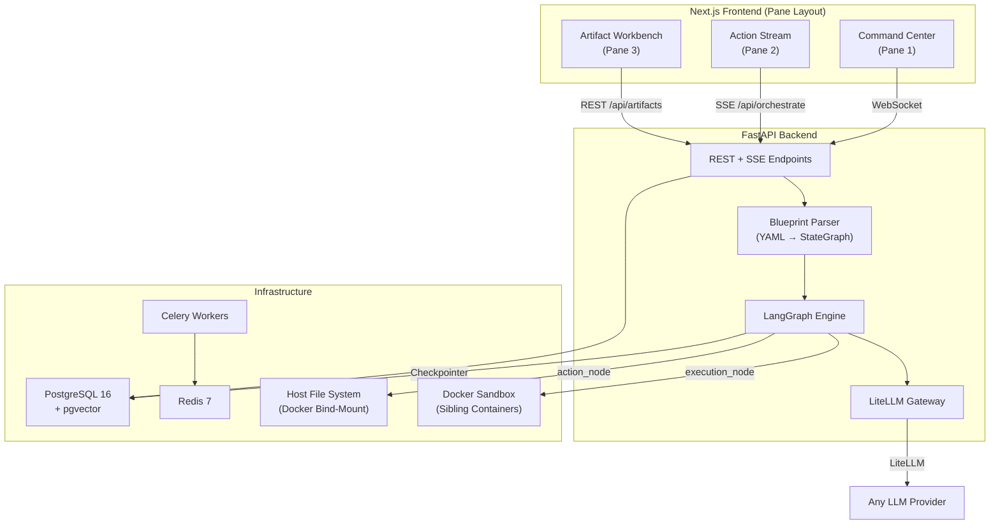
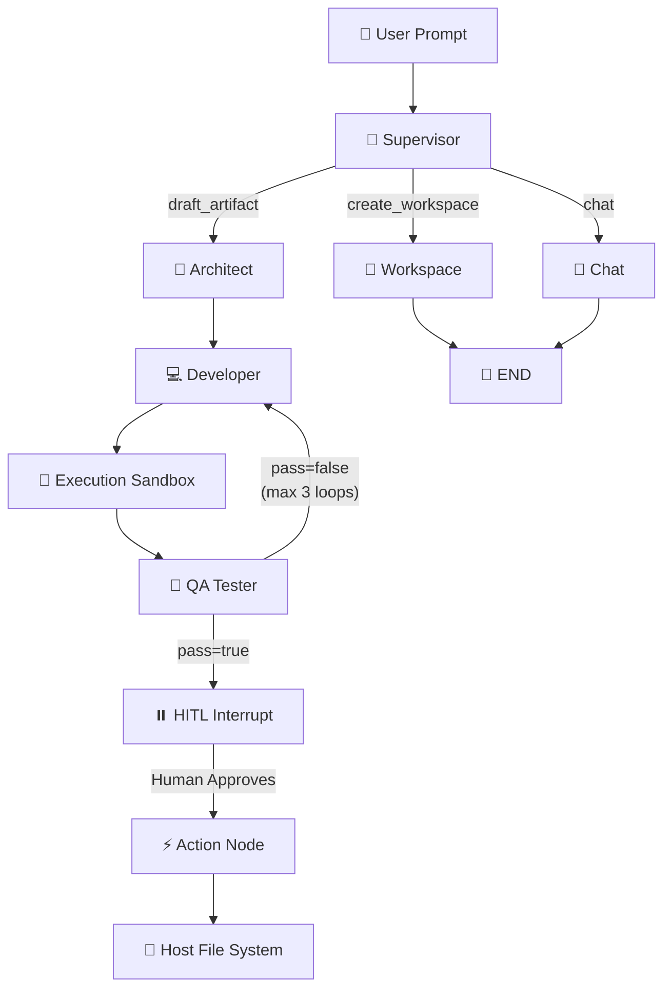

# System Architecture & Data Flow

SideloadOS is a decoupled, event-driven **Next.js + FastAPI** application that orchestrates multi-step AI workflows via a declarative YAML Blueprint system.

---

## 1. High-Level Architecture

---

## 2. Real-Time Communications

| Protocol | Purpose | Usage |
|----------|---------|-------|
| **WebSockets** (`ws://`) | System Actions | When LangGraph manipulates the DB (e.g., creates a Workspace), FastAPI broadcasts a WS event. The Zustand store re-renders the UI instantly without polling. |
| **Server-Sent Events** (SSE) | Agent Execution Streaming | `POST /api/orchestrate` streams graph execution events as SSE JSON chunks. The `useAgentStream` hook parses these into live WalkthroughCard steps. |

---

## 3. AI Gateway (Pillar 1)

Powered by **LiteLLM**, SideloadOS provides a unified interface to every major AI provider:

- **OpenAI** (GPT-4o, GPT-4o-mini, etc.)
- **Google Gemini** (gemini-2.0-flash, gemini-2.5-pro, etc.)
- **Anthropic Claude** (claude-sonnet-4, claude-opus-4, etc.)
- **Google Vertex AI** (via ADC — Application Default Credentials)
- **Ollama** (local models)

Provider API keys are stored AES-256 encrypted in PostgreSQL via `cryptography.fernet`.

---

## 4. Persistent Deep Memory (Pillar 2)

**Checkpointer Memory:** LangGraph state is persisted via **PostgreSQL Checkpointers** (`AsyncPostgresSaver`). Every conversation thread, agent state, and execution checkpoint is serialized to the database. Server restarts do not lose context.

**Deep Semantic Memory (RAG):** Workspace files are chunked via `RecursiveCharacterTextSplitter`, embedded using **HuggingFace `all-MiniLM-L6-v2`** (80MB local model, zero API keys), and stored as 384-dimensional vectors in **pgvector**. The Supervisor autonomously routes to:
- `ingest_node` — "Memorize my workspace" → walks files, embeds chunks, stores in `document_chunks`
- `rag_node` — "What does X do?" → cosine similarity retrieval → LLM-grounded answer

---

## 5. HITL Engine (Pillar 3)

When a LangGraph agent produces a draft artifact:

1. The graph **pauses** at an `interrupt_before` checkpoint (typically `action_node`).
2. The draft is **streamed** to the Artifact Workbench (Monaco for code, Tiptap for prose).
3. The workflow **waits** frozen in the database until the human acts.
4. On **Approve & Execute**, an isolated `BackgroundTask` resumes the graph.

---

## 6. Master Router (Pillar 5)

The Supervisor Node uses a **JSON-in-prompt** pattern instead of provider-specific tool-calling APIs:

1. A Pydantic `SupervisorDecision` schema is injected into the system prompt.
2. The LLM returns raw JSON, parsed by `_extract_json()`.
3. The validated decision routes via `route_from_supervisor()` to downstream nodes.

This works identically across all providers — **zero provider-specific code paths**.

---

## 7. Blueprint Matrix (Pillar 6)

SideloadOS compiles its graph topology from **YAML at runtime**:

1. `blueprint_schema.py` — Pydantic schema (`BlueprintDef`) validates YAML structure.
2. `blueprint_parser.py` — `importlib` dynamically imports handler functions from dotted paths.
3. `@lru_cache(maxsize=128)` — Each handler is imported once; YAML is read fresh.
4. The compiled `StateGraph` is returned ready for `.ainvoke()` / `.astream_events()`.

**Available Blueprints:**

| Blueprint | File | Description |
|-----------|------|-------------|
| SideloadOS Core | `default.yaml` | Standard Supervisor → Draft → Action pipeline |
| Software Engineering Swarm | `software_engineer.yaml` | 3-agent Architect → Developer → QA debate loop |

---

## 8. Multi-Agent Swarm Architecture

The Software Engineering Swarm blueprint introduces three specialized agents:

**Key Safety Features:**
- Loop guard: QA forces approval after 3 iterations.
- Fail-closed: JSON parse failures default to `pass=false`.
- No f-strings: Dynamic data injected via `HumanMessage` to prevent curly brace crashes.

---

## 8.1. Execution Sandbox

The Execution Sandbox runs AI-generated code in disposable, air-gapped Docker containers via the **sibling container pattern** (the FastAPI container communicates with the host Docker daemon through a mounted socket).

**Security Layers:**

| Control | Mechanism |
|---------|-----------|
| **Network Isolation** | `network_mode="none"` — blocks all internet access |
| **Memory Limit** | `mem_limit="128m"` — prevents fork bombs |
| **Timeout** | `container.wait(timeout=10)` — kills runaway loops |
| **Code Injection** | Environment variable (`CODE`) — avoids shell-escaping traps |
| **Container Cleanup** | `try/finally` with `container.remove(force=True)` — zero orphaned containers |
| **Log Truncation** | Output capped at 2000 chars — protects LLM context window |
| **Markdown Stripping** | `re.sub` strips backtick fences before `exec()` |

**Flow:** `Developer` → `execution_node` (sandbox) → `QA`. QA now reviews real terminal output (Tracebacks, exit codes) alongside the code and spec.

---

## 9. Local File I/O

When the human approves an artifact, the Action Node writes files to the host filesystem via a Docker bind-mount (`./workspaces:/app/workspaces`).

---

## 10. API Endpoints

| Method | Endpoint | Description |
|--------|----------|-------------|
| `POST` | `/api/orchestrate` | SSE streaming orchestration (accepts `blueprint_path`) |
| `GET` | `/api/workspaces/` | List all workspaces |
| `POST` | `/api/workspaces/` | Create a new workspace |
| `GET` | `/api/artifacts/{id}` | Fetch a specific artifact |
| `PUT` | `/api/artifacts/{id}` | Update artifact (human edits) |
| `POST` | `/api/artifacts/{id}/approve` | Approve & execute artifact |
| `GET` | `/api/blueprints/` | List all valid blueprint YAMLs |
| `GET` | `/api/models/available` | List all configured/discoverable LLM models |
| `GET/POST/PUT/DELETE` | `/api/settings/...` | Provider API key management |
