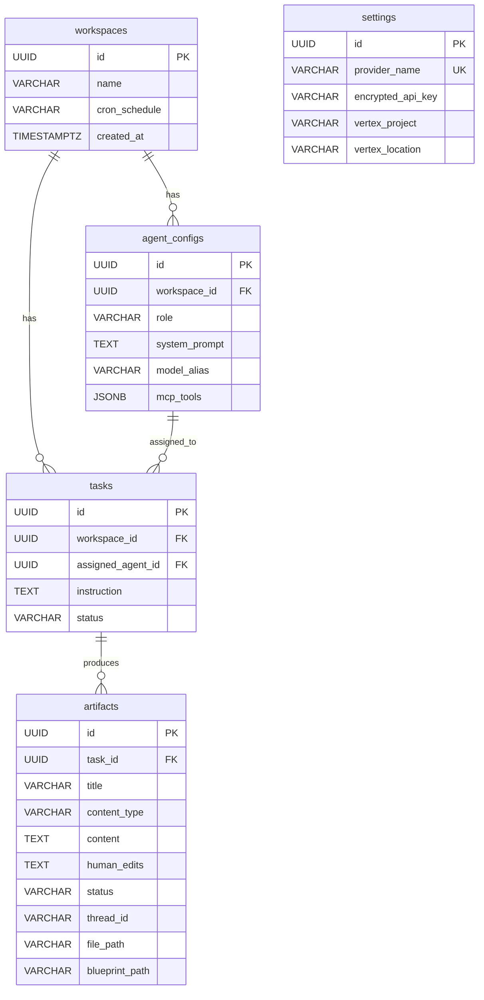

# Database Schema (PostgreSQL 16 + pgvector)

All tables use `UUID` primary keys via `asyncpg`. Managed by **SQLAlchemy 2.0** (async) + **Alembic** migrations.

---

## Entity Relationship Diagram



---

## Table Definitions

### `workspaces`

| Column | Type | Constraints | Description |
|--------|------|-------------|-------------|
| `id` | `UUID` | PK, default `uuid4` | Unique workspace identifier |
| `name` | `VARCHAR(255)` | NOT NULL | Display name |
| `cron_schedule` | `VARCHAR(100)` | NULLABLE | Optional Celery cron expression |
| `created_at` | `TIMESTAMPTZ` | default `utcnow` | Creation timestamp |

### `agent_configs`

| Column | Type | Constraints | Description |
|--------|------|-------------|-------------|
| `id` | `UUID` | PK | Unique agent config identifier |
| `workspace_id` | `UUID` | FK → `workspaces.id`, NOT NULL | Parent workspace |
| `role` | `VARCHAR(255)` | NOT NULL | Agent role label |
| `system_prompt` | `TEXT` | NOT NULL | System prompt for the agent |
| `model_alias` | `VARCHAR(255)` | NOT NULL | LiteLLM model alias |
| `mcp_tools` | `JSONB` | NULLABLE | MCP tool configuration |

### `tasks`

| Column | Type | Constraints | Description |
|--------|------|-------------|-------------|
| `id` | `UUID` | PK | Unique task identifier |
| `workspace_id` | `UUID` | FK → `workspaces.id`, NOT NULL | Parent workspace |
| `assigned_agent_id` | `UUID` | FK → `agent_configs.id`, NOT NULL | Assigned agent |
| `instruction` | `TEXT` | NOT NULL | Task instruction |
| `status` | `VARCHAR(50)` | NOT NULL, default `pending` | `pending`, `running`, `awaiting_approval`, `completed` |

### `artifacts`

| Column | Type | Constraints | Description |
|--------|------|-------------|-------------|
| `id` | `UUID` | PK | Unique artifact identifier |
| `task_id` | `UUID` | FK → `tasks.id`, NULLABLE | Parent task (null for swarm-generated) |
| `title` | `VARCHAR(255)` | NOT NULL | Short display title |
| `content_type` | `VARCHAR(100)` | NOT NULL | `text` or `code` |
| `content` | `TEXT` | NOT NULL | AI-generated content |
| `human_edits` | `TEXT` | NULLABLE | Human-modified content (null = no edits) |
| `status` | `VARCHAR(50)` | NOT NULL, default `pending` | `pending`, `draft`, `applied` |
| `thread_id` | `VARCHAR(255)` | NULLABLE | LangGraph thread ID for checkpointer |
| `file_path` | `VARCHAR(512)` | NULLABLE | Host filesystem path after write |
| `blueprint_path` | `VARCHAR(255)` | server_default `default.yaml` | Which blueprint created this artifact |

### `settings`

| Column | Type | Constraints | Description |
|--------|------|-------------|-------------|
| `id` | `UUID` | PK | Unique setting identifier |
| `provider_name` | `VARCHAR(255)` | NOT NULL, UNIQUE | Provider key (e.g., `openai`, `anthropic`, `google`) |
| `encrypted_api_key` | `VARCHAR` | NOT NULL | AES-256 encrypted API key via `cryptography.fernet` |
| `vertex_project` | `VARCHAR(255)` | NULLABLE | GCP project ID (Vertex AI only) |
| `vertex_location` | `VARCHAR(255)` | NULLABLE | GCP region/location (Vertex AI only) |

---

## LangGraph State Schema

The in-memory state flowing through graph nodes is defined in `engine/state.py`:

```python
class SideloadState(TypedDict):
    messages: Annotated[list[AnyMessage], add_messages]
    workspace_id: str
    current_task_id: Optional[str]
    draft_artifact_id: Optional[str]
    next_route: Optional[str]
    tool_kwargs: Optional[dict]
    chat_response: Optional[str]
    # Swarm memory keys (used by custom cartridges)
    tech_spec: Optional[str]
    code_draft: Optional[str]
    qa_feedback: Optional[str]
    swarm_iterations: Optional[int]
```

> **Note:** Swarm keys (`tech_spec`, `code_draft`, `qa_feedback`, `swarm_iterations`) are only populated when using the Software Engineering Swarm blueprint. They are ignored by the default Core blueprint.
